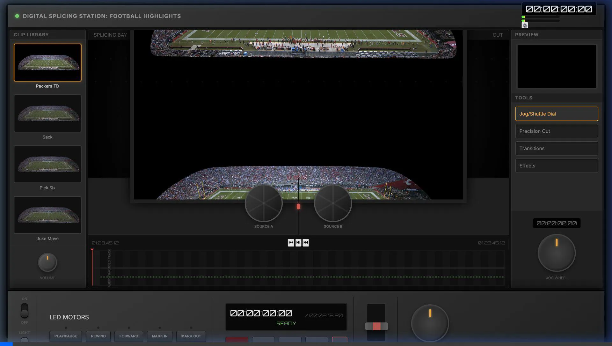
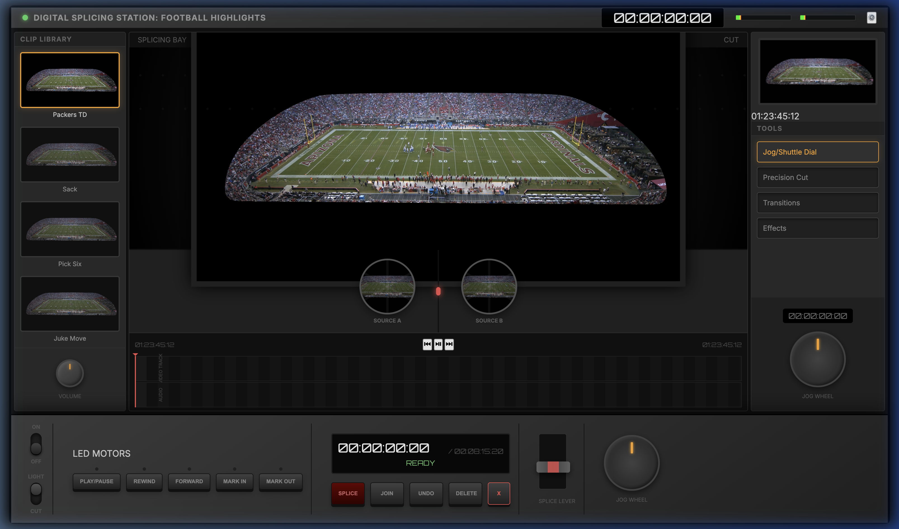
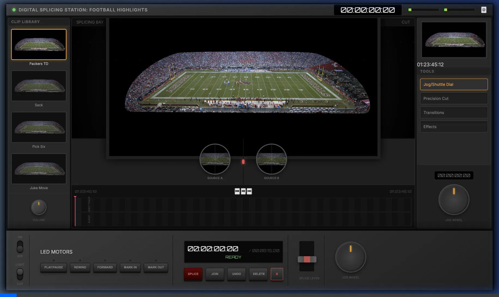

# Johns Video Splicer: Technical Walkthrough

This document archives the technical implementation and visual verification of the **Johns Video Splicer**, a high-fidelity digital splicing station for sports highlights.

## 1. Hardware Aesthetic Interface
- **Metallic Dark Theme**: Using custom CSS gradients and box-shadows to recreate a premium industrial look.
- **Interactive Knobs**: Volume and Jog wheels feature **Circular Steering** logic (drag UP on left side, DOWN on right side to rotate clockwise).
- **Control Deck**: Tactile transport buttons (Play/Pause, Rewind, Forward) with persistent hardware labels and integrated LEDs.

*Interactive controls demonstration.*

## 2. Video & Stereo Engine
- **HLS 4K Streaming**: Integrated `hls.js` to stream a 40Mbps 4K Top-Bottom stereo source.
- **View Modes**: Added specialized cropping for **LEFT**, **RIGHT**, and **STEREO** (full frame) views.
- **Splice Lever (Cross-fader)**: A vertical hardware lever that blends between the Left Eye (Top) and Right Eye (Bottom) video feeds in real-time.

*Verification of view mode switching and stereo cropping.*

## 3. Timeline & Audio Analysis
- **Mark In/Out Regions**: Persistent orange regions on the timeline for clip marking.
- **Persistent Waveform**: A recording system that captures and maps audio levels to the timeline as the video plays.
- **Real-Time VU Meters**: Header-mounted horizontal bars driven by the **Web Audio API** frequency analysis.

*Final stabilized header with real-time VU analysis.*

## 4. Action Preview Effects
- **Visual Feedback**: The 'SPLICE', 'JOIN', and 'DELETE' buttons trigger unique visual eye-blending and glitch effects in the preview monitor.

*Final verification of all interactive features.*
